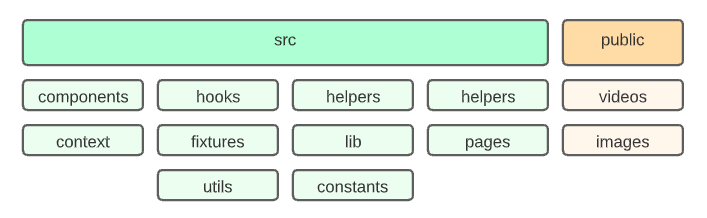
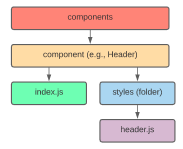
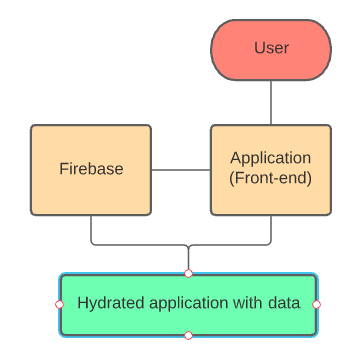

# Netflix Clone

### Project Description
This application is a clone of **Netflix** UI and is built using React and Firebase. 

The project is currently running live at: https://netflix-clone-1f2e8.firebaseapp.com


### Architecture
##### Folder Structure 


##### Compound Components Structure


##### App Flow


### Run this project
1. Clone the project
 
    ``` git clone https://github.com/bmo8699/netflix-clone.git ```
2. Install dependencies 

    ``` 
    $ cd netflix-clone
    $ yarn install 
    ```
3. Run the app

    ``` 
    $ yarn start 
    ```


